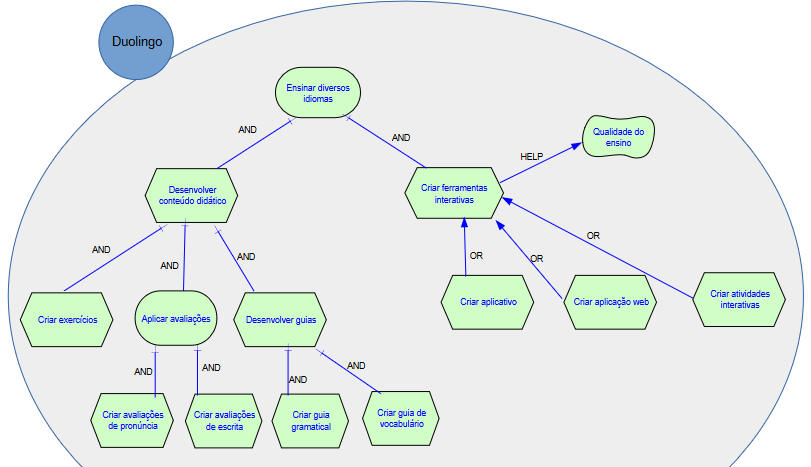
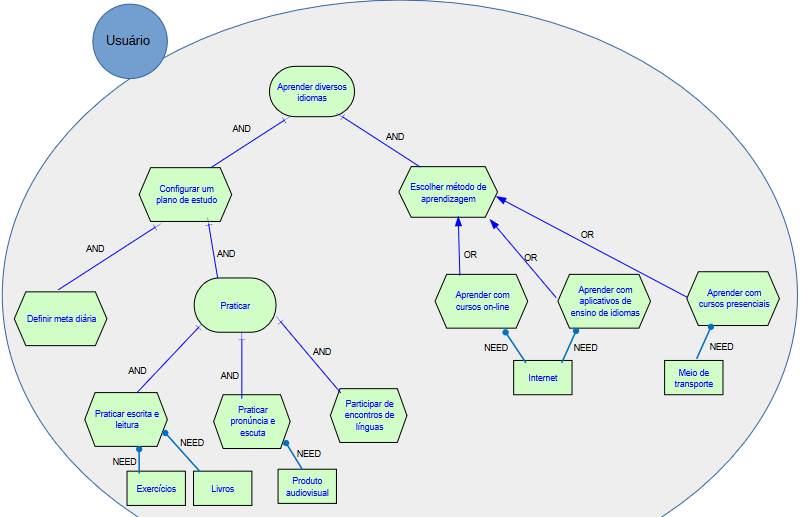
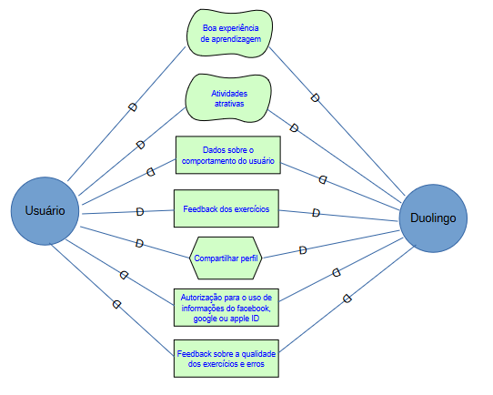
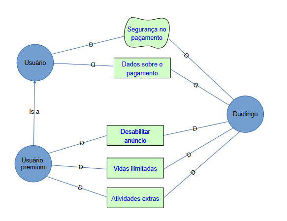
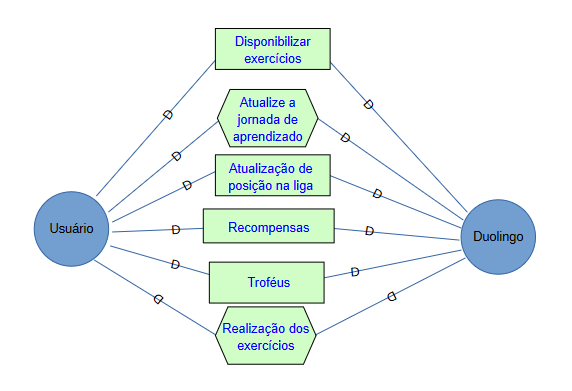

# Introdução

A estrutura i* oferece uma abordagem orientada por agentes para a engenharia de requisitos, focando nas intenções dos agentes. Esses agentes atribuem entre si propriedades intencionais, como metas, crenças, habilidades e compromissos, e refletem sobre suas interações estratégicas. As dependências que surgem entre eles criam tanto oportunidades quanto vulnerabilidades. Para analisar essas redes de dependência, utiliza-se um raciocínio qualitativo. Os agentes exploram diferentes configurações de dependências para avaliar sua posição estratégica em um contexto social.

### Duolingo

### Usuário

### Dependência usuário-app

### Premium

### Pontuação

## Histórico de Versão

| Data | Versão | Descrição | Autor(es) |
| ---- | ------ | --------- | --------- |
| 12/09/2024 | 1.0 | Adicionando IStar | Vinícius de Oliveira |