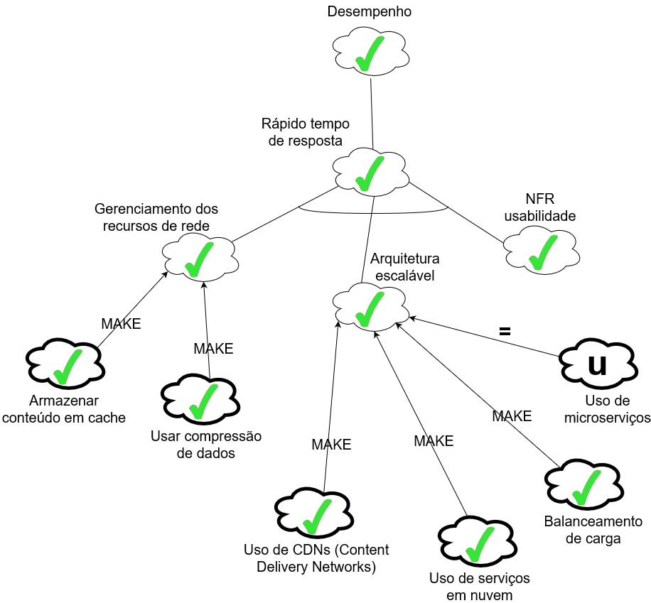

# Introdução

O NFR Framework é uma abordagem orientada a processos, utilizada para a validação de requisitos não funcionais, por meio do uso de critérios de qualidade e requisitos funcionais. Neste projeto, o NFR Framework foi empregado para compreender os requisitos não funcionais e verificar como eles estão sendo atendidos na aplicação.

## NFR-Desempenho

## NFR-Usabilidade

## NFR-Acessibilidade

## Histórico de Versão

| Data | Versão | Descrição | Autor(es) |
| ---- | ------ | --------- | --------- |
| 16/08/2024 | 1.0 | Criação da aba NFR Framework | Vinícius de Oliveira |
| 16/08/2024 | 1.1 | Adicionando introdução e imagens da usabilidade e desempenho | Vinícius de Oliveira |
| 16/08/2024 | 1.2 | Adicionando NFR da acessibilidade | Vinícius de Oliveira |
| 12/09/2024 | 1.3 | Adicionando propagação dos NFR | Vinícius de Oliveira |