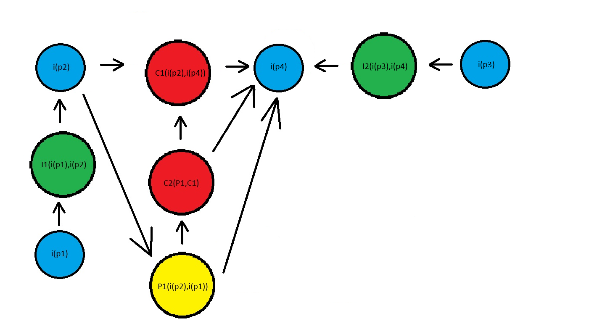

# Argumentação

## Introdução
A <strong>argumentação</strong> é uma técnica de pré-rastreabilidade amplamente utilizada em atividades em grupo. Seu objetivo é permitir que diferentes pontos de vista sejam ouvidos e debatidos, para que, ao final, se alcance um consenso e uma conclusão racional.

## Objetivo
O uso da argumentação neste projeto busca promover a resolução de pontos de vista conflitantes, permitindo a rastreabilidade de todos os argumentos levantados.

## Argumentação Realizada

**Questão**
<a>
É necessário ter outros Rich pictures além do geral?
</a>

**Argumentos**

- <a>p1</a> - É necessário, pois existe casos específicos que podem ser documentados. (Vinícius)
- <a>p2</a> - É necessário, pois além do artefato cenário, há uma representação visual do fluxo. (Bruno)
- <a>p3</a> - Não é necessário, pois o geral já aborda todo o conceito da aplicação. (Felipe)

**Conclusão** 
<a>
Haverá mais Rich Pictures além do geral, dependendo do caso que está sendo analisado.
</a>

---

**Questão**
<a>
O que é mais importante para a aplicação do duolingo?
</a>

**Argumentos**

- <a>p1</a> - A gamificação é o mais importante para a aplicação, pois consegue reter a atenção dos usuários.
- <a>p2</a> - Com a gamificação é possível criar novos métodos de ensino e facilita a divulgação entre os usuários.
- <a>p3</a> - O ensino é o mais importante, pois o usuário quer aprender o idioma desejado
- <a>p4</a> - Com o foco no ensino é possível criar fluxos mais completos para o aprendizado.

**Conclusão** 
<a>
O mais importante para o Duolingo é a gamificação, pois é algo diferente no mercado de ensino de línguas estrangeiras e com a gamificação é possível criar fluxos completos e personalizados para cada usuário, sendo assim mantendo o usuário por mais tempo na aplicação.
</a>

---

# Histórico de Versão
| Data | Versão | Descrição | Autor(es) |
| ---- | ------ | --------- | --------- |
| 29/07/2024 | 1.0 | Adição da primeira argumentação | Vinícius de Oliveira |
| 16/08/2024 | 2.0 | Adição da segunda argumentação | Vinícius de Oliveira |